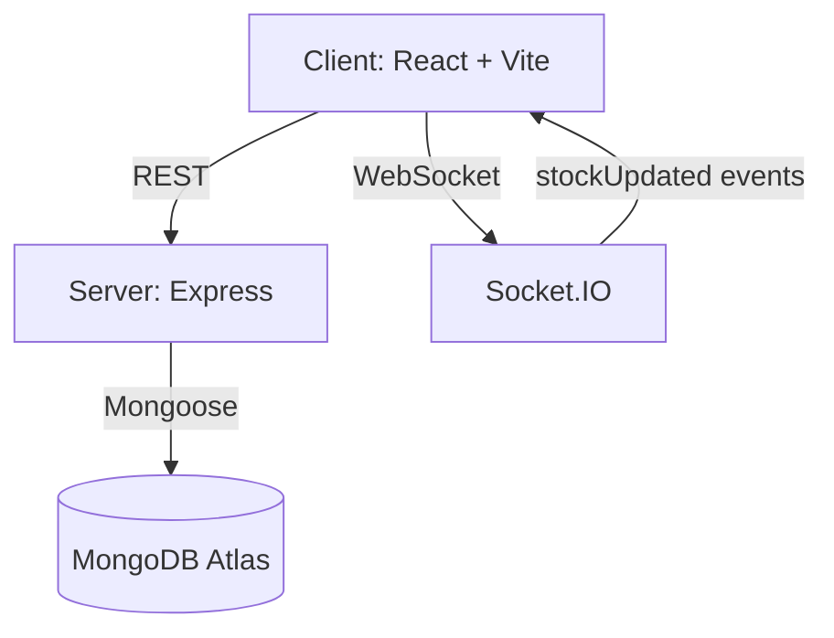

# Smart Grocery Delivery Platform

## 📸 Screenshots
🛍️ Products Page


🛒 Cart Page


📦 Orders Page


## 🌐 Live Demo
Frontend: https://your-app.netlify.app
Backend API: https://your-api.onrender.com

## 💡 Why This Project Matters?
This project simulates a real-world grocery delivery system like Blinkit/Zepto with:

Real-time stock synchronization across users via Socket.IO

Strict order lifecycle enforcement (state machine)

Concurrency-safe checkout using MongoDB transactions

Role-based access control (RBAC) for Admin, Delivery Partner, and Customer

It demonstrates full-stack system design, real-time communication, and production-ready architecture.

## 🏗️ Architecture


## Tech Stack (Fixed)
- Frontend: React (Vite) + Tailwind CSS
- Backend: Node.js + Express
- Database: MongoDB (Mongoose)
- Authentication: JWT + bcrypt (hashing)
- Deployment:
  - Frontend: Netlify
  - Backend: Render (or Railway)
  - Database: MongoDB Atlas

## Folder Structure (Mandatory)
- `client/` frontend
- `server/` backend

## Roles & Strict RBAC
The backend enforces Role-Based Access Control for these roles:
- `admin`
  - Add/Edit/Delete products
  - Manage user roles
  - View all orders
  - Assign delivery partners to orders
- `delivery_partner`
  - View assigned orders
  - Update status: `assigned -> picked -> delivered`
- `customer`
  - Browse products
  - Add items to cart
  - Place orders
  - Track own orders

## Authentication & Security
- Endpoints:
  - `POST /auth/register`
  - `POST /auth/login`
  - `GET /auth/me`
- Password hashing:
  - Stored using `bcryptjs` hashing
- Protected routes:
  - Backend uses JWT middleware (`auth`)
  - Frontend enforces role-based route access
- Proper error handling:
  - Validation errors return `400` with details (via `express-validator`)
  - Forbidden actions return `403`

## Products
- Public endpoint:
  - `GET /products` (active products only)
- Admin endpoints:
  - `POST /products`
  - `PATCH /products/:id`
  - `DELETE /products/:id` (soft-delete via `isActive=false`)

## Cart (Fix: “Add” button now works)
Cart is implemented with a persisted backend cart model, so the navbar cart count and checkout are consistent.

Backend cart endpoints (protected):
- `GET /api/cart`
- `POST /api/cart/add`
  - Body: `{ productId, quantity }`
  - Validates product exists and stock availability before adding
  - Prevents adding beyond available stock
  - Responds with updated cart items and `cartCount`
- `PATCH /api/cart/item`
  - Body: `{ productId, quantity }`
  - Validates latest stock before updating quantity
- `POST /api/cart/remove`
  - Body: `{ productId }`

Frontend:
- “Add” button calls `POST /api/cart/add`
- Button is disabled when stock is `0`
- Shows toast: `Item added to cart`
- Navbar cart count updates immediately after API response
- Cart quantities are adjusted using `+ / -` buttons, with stock validated before updating

## Real-Time Stock Update (Socket.IO)
When checkout reduces product stock, the backend emits a Socket.IO event:
- Event: `stockUpdated`
- Payload: `{ productId, newStock }`

Frontend:
- Connects once globally using `socket.io-client`
- Listens for `stockUpdated`
- Updates product stock in the UI instantly (no refresh)
- Also updates cart item stock display so quantity controls remain accurate

## Order Lifecycle (Strict State Machine)
Order status transitions are enforced server-side:
`created -> confirmed -> assigned -> picked -> delivered`

Invalid transitions are rejected.

Customer checkout behavior:
- Checkout creates order in `created`
- Then transitions to `confirmed` inside the service (only if allowed)

Admin / Delivery Partner behavior:
- Admin assigns partners only via `/orders/:orderId/assign`
- Delivery partners can update only to `picked` and `delivered` via `/orders/:orderId/status`

## Concurrency Handling (Critical Overselling Prevention)
Checkout runs with a MongoDB transaction/session:
- Validate product stock before confirming order
- Decrement stock inside the transaction
- If any item is insufficient, the transaction aborts

Stock events are emitted after the commit to ensure every client sees committed values.

## UI/UX Improvements
- Responsive layout with Tailwind:
  - Product grid: `grid-cols-1 sm:grid-cols-2 md:grid-cols-3 lg:grid-cols-4`
  - Mobile-first layout and readable typography
  - Navbar supports a working hamburger menu on small screens
  - Search + “In-stock only” filter stacks vertically on mobile and aligns inline on desktop
- Products page:
  - Card UI: `rounded-2xl` + `shadow-lg` + hover scale animation
  - Product images: uses `imageUrl` with `object-cover`, and gracefully falls back when an image fails to load
  - Stock badge:
    - `In Stock`
    - `Only X left`
    - `Out of Stock`
  - Real-time visual feedback: when stock updates via Socket.IO, the badge briefly pulses/animates
  - Search + “In-stock only” filter
- Cart page:
  - Card-style layout with product image, price, and quantity controls
  - Quantity uses touch-friendly `+ / -` buttons (no text input)
  - Total price is clearly highlighted
  - `Place Order` button supports loading/disabled states and displays error messages inline
  - Skeleton loading + empty state + error UI
- Orders page (Customer) and Delivery page (Delivery Partner):
  - Orders are displayed as cards, not plain text
  - Each order shows an item list, address, total, and current status in a badge
  - Order timeline is rendered as `Confirmed → Assigned → Picked → Delivered`
  - Delivery actions (“Mark Picked”, “Mark Delivered”) are styled as primary CTAs with updating state
- Loading + feedback:
  - Toast notifications for success/error (`react-hot-toast`)
  - Skeleton loading while fetching data
  - Empty states (“No products found”, “No orders yet”) and inline error components

## First-Run Seeding (No manual setup required)
The server can automatically seed:
- 1 admin user
- 2 delivery partners
- Sample products (with real images)

Seeding runs only when `SEED_ON_START=true`.

Default seeded credentials (dev/testing):
- Admin
  - Email: `admin@smartdelivery.local`
  - Password: `Admin12345`
- Delivery partners
  - Email: `partner1@smartdelivery.local`, `partner2@smartdelivery.local`
  - Password: `Partner12345`

### Seed env vars
In `server/.env`:
- `SEED_ON_START=true`
- `SEED_ADMIN_NAME`, `SEED_ADMIN_EMAIL`, `SEED_ADMIN_PASSWORD`
- `SEED_DELIVERY_PARTNERS`, `SEED_DELIVERY_PARTNER_PASSWORD`

## API Summary
Main REST routes:
- Auth:
  - `/auth/*`
- User (admin-only):
  - `/users/*`
- Products:
  - `/products/*`
- Orders (protected):
  - `/orders/*`
- Cart:
  - `/api/cart/*`

## 🔑 Environment Variables

### Backend (`server/.env`)
```txt
PORT=5000
MONGO_URI=YOUR_MONGODB_ATLAS_CONNECTION_STRING
JWT_SECRET=YOUR_RANDOM_SECRET
JWT_EXPIRES_IN=7d
CLIENT_URL=http://localhost:5173,https://your-netlify-site.netlify.app

# Optional: enables automatic seeding on startup for demo/testing
SEED_ON_START=true
SEED_ADMIN_NAME=Admin
SEED_ADMIN_EMAIL=admin@smartdelivery.local
SEED_ADMIN_PASSWORD=Admin12345
SEED_DELIVERY_PARTNERS=partner1@smartdelivery.local,partner2@smartdelivery.local
SEED_DELIVERY_PARTNER_PASSWORD=Partner12345
```

### Frontend (`client/.env`)
```txt
VITE_API_BASE_URL=http://localhost:5000
```

In production, set `VITE_API_BASE_URL` to your deployed backend URL.

## 🧪 How to Test
1. Register/Login as a **Customer**
2. Go to **Products**, add items to cart, and **Place Order**
3. Open another browser tab (stay on Products) and confirm the stock badge updates in real-time
4. Login as a **Delivery Partner** and confirm assigned order status timeline updates (`assigned -> picked -> delivered`)
5. Login as **Admin** to assign a delivery partner from the Admin dashboard

## 🚀 Getting Started

### 1) Backend
```bash
cd server
cp .env.example .env
npm install
npm run dev
```

### 2) Frontend
```bash
cd client
cp .env.example .env
npm install
npm run dev
```

## Deployment Ready

### Frontend (Netlify)
- Publish: `client/dist`
- Base directory: `client`
- Build: `npm run build`
- Env var:
  - `VITE_API_BASE_URL=https://<your-backend-domain>`

`client/netlify.toml` includes SPA redirect so routes like `/cart` work on refresh.

### Backend (Render/Railway)
- Root directory: `server`
- Build: `npm install`
- Start: `npm start`
- Env vars required:
  - `PORT`
  - `MONGO_URI`
  - `JWT_SECRET`
  - `JWT_EXPIRES_IN`
  - `CLIENT_URL` (Netlify URL, comma-separated if needed)

### Database (MongoDB Atlas)
- Create Atlas cluster + database user
- Copy the Atlas connection string into `server/.env` as `MONGO_URI`
- Make sure Atlas network access allows your environment to connect
