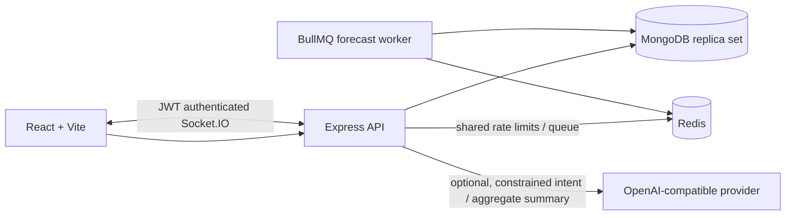

# Smart Grocery AI

A MERN grocery commerce app with transactional checkout, authenticated real-time inventory updates, catalog-grounded grocery search, purchase-history recommendations, deterministic substitution and demand insights, workload-aware delivery assignment, optional LLM summaries, and optional Redis/BullMQ forecast jobs.

## Quick start (Docker)

Requirements: Docker Compose and a random JWT secret of at least 32 characters.

```bash
cp .env.example .env
# Replace the sample passwords and JWT_SECRET in .env before starting.
docker compose up --build
```

Open [http://localhost:8080](http://localhost:8080). MongoDB runs as a single-node replica set for transactions; Redis stores shared rate limits and forecast-job data. The synthetic demo catalogue/history and demo users are controlled by `SEED_ON_START` and `SEED_DEMO_DATA`; change the credentials before using the local demo.

Stop the stack with `docker compose down`. Database and Redis data live in Docker volumes. To reset the demo data, `docker compose down -v` removes those volumes.

## Local development

1. Start MongoDB as a replica set and Redis, or use their Compose services.
2. Copy `server/.env.example` to `server/.env`, set a strong `JWT_SECRET` and `MONGO_URI`, and optionally configure Redis/LLM.
3. In `server/`, run `npm ci`, then `npm run dev`; run `npm run worker` in a second terminal when Redis is available.
4. In `client/`, run `npm ci` and `npm run dev`. The API defaults to `http://localhost:5000`.

## Product behavior and security

- Customers own their cart and orders. Checkout reads persisted cart contents, revalidates product availability, atomically decrements inventory, creates the order, and clears the cart in one MongoDB transaction. Use the `Idempotency-Key` header to safely retry.
- Product updates are admin-only and allowlisted. Customer, admin, and delivery routes validate input and enforce role/ownership boundaries.
- Socket.IO authenticates JWTs; public stock changes reach authenticated clients, while order updates are emitted only to the customer, assigned delivery partner, and admins.
- Exact CORS origins are configured with `CLIENT_URL`. Redis-backed rate limits are shared across instances when `REDIS_URL` is configured; a bounded local fallback supports development.
- API errors omit stack traces and include a request ID. `/health` is liveness; `/ready` checks MongoDB and configured Redis.

## Intelligence capabilities

- `GET /products?q=&category=&minPrice=&maxPrice=&inStock=` filters the active catalogue.
- `POST /api/assistant/grocery` extracts constrained search intent with an optional OpenAI-compatible LLM and returns only matching live products. If the provider is unset or unavailable, a catalogue-search fallback is used.
- `GET /api/recommendations?mode=personalized|buy-again|frequently-bought-together&productId=` uses customer purchase history and current availability.
- `GET /api/products/:productId/substitutions` ranks active in-stock alternatives using category and price proximity.
- Admin analytics use aggregate order/product records. Forecasts use delivered-order quantities over the prior 90 days, and report insufficient history when fewer than seven observed demand days exist.
- Admins can queue forecast refresh jobs at `POST /api/admin/analytics/forecast/refresh`. Redis is optional; the synchronous forecast API works without the queue. Run `npm run worker` in a separate server process.
- Delivery auto-assignment selects the partner with the fewest active orders. Delivery route planning orders geotagged customer stops using a nearest-neighbor great-circle estimate. It does not model roads, traffic, or turn restrictions.

## Demo users and synthetic history

Set `SEED_ON_START=true` plus the `SEED_ADMIN_*` and `SEED_DELIVERY_*` values to seed admin/partner accounts. Set `SEED_DEMO_DATA=true`, `SEED_CUSTOMER_EMAILS`, and `SEED_CUSTOMER_PASSWORD` to add customer accounts and repeatable 58-day synthetic delivered-order history. Seeded passwords are environment values and are never defaults in source code. History orders carry deterministic private seed keys and do not change current stock.

See [FINAL_DEMO_GUIDE.md](FINAL_DEMO_GUIDE.md) for a role-by-role walkthrough and API checks.

## Test and build checks

```bash
cd server
npm run check
npm test
cd ../client
npm test
npm run lint
npm run build
```

The checkout integration test skips unless `MONGO_TEST_URI` points to a disposable replica set. Run the real MongoDB + Redis suite with:

```bash
docker compose -f docker-compose.mongo-test.yml run --rm checkout-tests npm test -- --test-reporter=spec
```

## Architecture


```mermaid
flowchart LR
  Browser[React + Vite] --> API[Express API]
  Browser <-->|JWT authenticated Socket.IO| API
  API --> Mongo[(MongoDB replica set)]
  API -->|shared rate limits / queue| Redis[(Redis)]
  Worker[BullMQ forecast worker] --> Redis
  Worker --> Mongo
  API -->|optional, constrained intent / aggregate summary| LLM[OpenAI-compatible provider]
```

Core truth remains in MongoDB: the LLM cannot select database operators or establish products, prices, inventory, customer facts, or permissions. Redis, the worker, and the LLM are optional dependencies for browsing and checkout.
