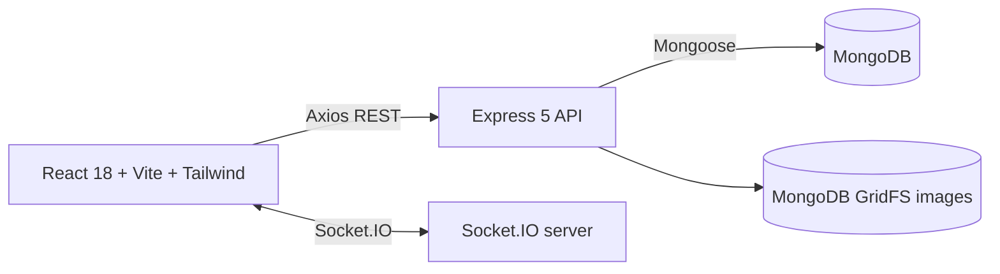

# Smart Grocery AI — Repository Audit and Upgrade Plan

**Audit date:** 2026-10-02  
**Repository:** `SrujanRaj-cse/Smart-Grocery-Delivery-Platform-` (`main`)  
**Scope:** Static inspection of the checked-out source, package manifests, and README. No source code changes or runtime tests were performed during this audit.

## Executive summary

This repository is a small, single-server React + Express + MongoDB application. Its existing foundation is useful: JWT authentication, role checks, a persistent per-user cart, a transactional checkout service, a basic order transition table, admin product/user/order screens, and a public Socket.IO stock broadcast. It is not yet the larger production-style platform described in the supplied brief. There is no AI, Redis, job queue, forecasting, recommendation, audit, analytics, or automated test infrastructure in the checked-out source.

The first work should stabilize security and transactional boundaries, establish API and test conventions, and then incrementally deliver user-visible intelligence using verified MongoDB data. Keep the `client/` and `server/` split and current order states; avoid introducing Redis, queues, or provider SDKs before a concrete feature needs them.

## A. Current architecture



- **Frontend:** Vite/React 18, React Router 6, Tailwind 3, Axios, `react-hot-toast`, and `socket.io-client`. UI pages are in `client/src/pages`; shared auth/cart/product state uses React contexts.
- **Backend:** Node.js ES modules, Express 5, Mongoose 8, `express-validator`, JWT, `bcryptjs`, Helmet, Morgan, Multer, and Socket.IO 4. The actual structure is `server/src/{config,controllers,middleware,models,routes,seed,services,socket,utils}`.
- **Persistence:** MongoDB models for `User`, `Product`, `Cart`, and `Order`. Product images are stored in GridFS. No migrations or explicit index management are present.
- **Authentication:** Bearer JWT middleware resolves the current user from MongoDB; role middleware protects admin and delivery actions. The UI stores token/user in `localStorage` and adds the token to Axios requests.
- **Checkout:** `server/src/services/orderService.js` uses a MongoDB session transaction, decrements stock, snapshots price/name into order items, and emits stock updates after transaction commit.
- **Realtime:** Socket.IO emits one global `stockUpdated` event. There are no authenticated socket identities or user/order rooms.
- **Deployment/config:** Netlify and Render configuration exists; `.env.example` files are provided. `server/src/app.js` currently enables CORS for all origins despite retaining an unused `CLIENT_URL` allowlist implementation in comments.

## B. Current strengths

- Checkout derives product names/prices from current database records rather than trusting client-supplied price values.
- Checkout stock decrements and order creation happen in one MongoDB transaction; the client event is emitted after commit.
- Passwords are selected out of normal User queries and hashed with bcryptjs at cost 12.
- Registration always creates a customer; role changes require an admin route.
- The order lifecycle is centralized in `VALID_ORDER_TRANSITIONS` and the service checks actor role/assignment for delivery transitions.
- Cart, products, orders, users, and delivery screens already establish a useful user-flow baseline, including some loading/error/empty states.
- Product deletion is soft deletion (`isActive=false`), and seed logic is opt-in via `SEED_ON_START`.
- No `.env` files are tracked in the repository inventory; example files use placeholders/configuration.

## C. Problems, technical debt, and security findings

### High priority

1. **CORS is effectively open.** `server/src/app.js` uses `origin: true` with credentials, so any requesting origin is echoed. Replace with the configured exact-origin allowlist and a clear development policy; apply equivalent checks to Socket.IO.
2. **Product update accepts an unrestricted request body.** `updateProduct` passes `req.body` directly to `findByIdAndUpdate`. Current validators cover a few fields only; the endpoint needs an allowlisted DTO and full parameter/field validation.
3. **Checkout and cart consistency have a failure window.** Checkout commits the order/stock transaction, then `orderController` deletes the cart outside that transaction. A delete failure returns an error after the order has been placed, encouraging duplicate retries. Include the cart clear in the same transaction or make checkout idempotent and return the committed order on safe retry.
4. **No rate limiting or request size policy.** Auth endpoints are unthrottled; JSON body parsing has no explicit size limit. Add endpoint-aware limits and a small body cap before exposing AI endpoints.
5. **Image validation trusts MIME metadata.** Multer checks declared MIME type and size, but does not inspect file signatures. Upload failures can also leave an orphaned GridFS file if product creation fails.
6. **No automated tests or backend quality scripts.** Server package scripts contain only `dev` and `start`; client has lint/build but no tests. Critical auth, RBAC, checkout, and state transitions are unprotected by regression tests.

### Medium priority

- **No global rate/error observability convention:** Morgan is in `dev` format in all environments. Error middleware may serialize raw internal `err.message` for uncaught 500 errors. Bootstrap logs raw errors. Adopt structured logging, request IDs, and safe client errors while keeping details server-side.
- **JWT secret is not validated at startup.** Missing/weak `JWT_SECRET` is discovered only when signing/verifying requests. Validate required configuration at bootstrap; never report secret values.
- **JWT/session lifecycle is basic.** Access tokens last seven days by default, have no issuer/audience policy, revocation, or refresh flow. `localStorage` tokens are exposed to successful XSS. Decide an interview-demo-appropriate threat model before changing auth storage/session shape.
- **Role and identity edge cases:** Admin can change their own role or demote the final admin; no audit trail exists. Add explicit protections and audit records before extending user administration.
- **Order endpoints lack robust parameter checks and concurrency guards.** `orderId`, `deliveryPartnerId`, and several IDs are only checked as nonempty strings. Admin assignment/status persistence is a read-check-save sequence and can race; apply atomic conditional updates and validate ObjectIds.
- **Cart writes are read-modify-save.** Concurrent changes on one user's cart can overwrite each other; unique cart user index exists but its enforcement is not handled on duplicate creation. Consider atomic updates and duplicate-key handling.
- **Checkout does not aggregate duplicate product IDs in the request.** Repeated line items are checked/updated sequentially in the session; behavior should be normalized and tested, with clear quantity limits.
- **Order query unbounded.** `/orders` loads and populates all matching orders with no pagination or date filter. `/products` is also unbounded.
- **Image route accepts arbitrary path strings before `ObjectId` conversion and returns generic 404.** Add explicit ID validation, safe cache headers/content-type handling, and upload cleanup.
- **Frontend resilience:** `AuthContext` parses local storage synchronously without guarding malformed JSON; `/auth/me` failure is not caught (only `finally`), leaving an unhandled rejection. API errors are inconsistent, and many admin actions do not catch failures.
- **UI/product UX is basic:** no dedicated search service/pagination, categories, recommendation views, accessible confirmation patterns, profile page, or structured admin analytics. Money is rendered with `$` while the supplied product examples and requested experience use ₹; seed product amounts are USD-like.
- **Seed data is too small and inconsistent for the requested demo:** three products, no seeded customer, no historical orders, and sample images/prices do not provide Indian grocery demo coverage. README demo credentials and sample image claims should be reviewed against actual environment needs; do not use defaults in production.
- **Duplicate-looking socket entrypoint:** `server/src/server.js` imports `../socket/socket.js`, which is a compatibility re-export to `src/socket/socket.js`. Keep one canonical implementation once compatibility needs are confirmed.

### Documentation gaps / mismatch

README describes production-ready architecture and detailed UI behavior, but the implementation is still a small prototype. There is no test command, no pagination, no real-time order-state event, no AI feature, no inventory/demand history model, no Redis/queue, and no historical seed corpus. README states API summary paths, but `cart` lives under `/api/cart`; document exact paths consistently. It also shows seeded default credentials that are sensitive if enabled with those values. Treat README as intent/context, not a full implementation inventory.

## D. Recommended architecture

Preserve the monolith and current folder organization. Expand in place first, grouping new capabilities under `server/src/ai`, `server/src/analytics`, and `server/src/jobs` only when implemented. Keep controllers thin and move data/business operations into focused services.

```text
client/ (React app; route/page features, shared API/auth/cart state)
server/src/
  config/       validated environment, database, optional Redis/provider config
  routes/       HTTP wiring and request validators
  controllers/  request/response translation only
  middleware/   auth, role, validation, errors, request IDs, throttles
  models/       existing schemas plus only justified additions
  services/     checkout, inventory, recommendations, assignments, analytics
  ai/           provider adapter, schemas, prompts, grounded feature services
  jobs/         queue producers and job definitions if async needs are proven
  socket/       authenticated identity, scoped rooms, event contracts
  utils/        shared constants and small helpers
```

Use MongoDB as the source of truth. Add Redis only for measured cache/rate-limit/queue requirements, with explicit TTLs and invalidation. Do not make Redis a prerequisite for core shopping or checkout. Keep provider calls behind a small interface and return deterministic database-backed fallback results when unavailable.

## E. Proposed AI architecture

Use an optional **intent-to-validated-filter-to-database** pipeline. Model output is a constrained, schema-validated intent object (category, bounded budget, dietary/preferences, exclusions, quantities); application services translate that object to allowlisted MongoDB conditions. Fetch actual active/in-stock products and supply compact, verified product records to response generation. The final output must reference only those records; backend validates IDs and prices again before returning actions. Never accept generated MongoDB syntax, price/stock/order facts, or permissions.

Suggested boundaries:

- `ai/provider`: provider-neutral `generateStructured`/`generateText` contract, timeout, cancellation, metrics, and provider-disabled mode.
- `ai/assistant`: intent schema, product search orchestration, grounded response composer, deterministic fallback.
- `ai/recommendations`: rules-based recommendations first; label as rules-based and score using purchase history/category/popularity/availability.
- `ai/substitutions`: deterministic category/attribute/price/stock compatibility ranking with explainable score; no LLM required initially.
- `analytics/forecasting`: historical order aggregation and a simple baseline (recent moving average plus weekday adjustment where adequate history exists), uncertainty and reorder policy; display “insufficient history” where needed.
- `ai/admin`: allowlisted operational questions mapped to aggregate-only tools; admin authorization at the API/service boundary and no customer PII by default.

LLM calls must be optional and time-bounded. Do not send addresses, emails, credentials, or full order records to an external provider. Store no conversation history by default until retention and privacy needs are defined.

## F. Database changes

Add only as features need them; preserve existing documents and provide defaults/backfill strategy.

- **Product:** add category, normalized searchable terms, optional attributes/brand/unit, and a minimum-stock/reorder configuration only after catalogue UI supports them. Retain existing fields.
- **Order:** retain lifecycle and snapshot item pricing; add transition timestamps and optional idempotency key / delivery assignment metadata. Avoid address expansion unless delivery workflows require it.
- **InventoryEvent (recommended for forecasting):** product ref, signed quantity delta, reason, source/order ref, actor ref where applicable, and timestamp. Record checkout and admin adjustments from a single inventory service.
- **Optional AuditLog:** actor, action, target type/id, safe metadata, timestamp; exclude secrets and unnecessary PII.
- **Forecast snapshots (optional):** persist computed product/day horizon, predicted demand, uncertainty, recommended reorder, model/baseline version, and generatedAt; otherwise compute on demand for small data.
- **Indexes:** retain unique `User.email` and `Cart.user`; add compound `Order` indexes for customer+createdAt and deliveryPartner+status+createdAt; add Product active/category/price or search indexes matching actual query patterns; InventoryEvent product+occurredAt. Verify index build behavior on existing deployment before enforcing uniqueness.

## G. API changes

Keep existing URLs and response contracts initially; add consistent envelopes only in a versioned or client-compatible way.

- Harden existing auth/product/cart/order/user endpoints: allowlisted input, ID validation, pagination, safe error shape, consistent status codes, rate limiting.
- `GET /products`: add validated query filters (`q`, category, price bounds, inStock, cursor/page) without allowing arbitrary query operators.
- `POST /orders`: transactionally clear cart and support an idempotency key; keep server-authoritative prices and stock.
- `GET /recommendations`, `/recommendations/buy-again`, `/recommendations/frequently-bought-together`: customer-authenticated, stock-aware, paginated/limited.
- `POST /assistant/grocery`: customer-authenticated; accept natural language and return validated intent, grounded product cards, and explanations; cap input and provider latency.
- `GET /products/:id/substitutions`: actual active, in-stock product IDs with explainable compatibility scores.
- Admin-only `/admin/inventory/forecasts` and `/admin/insights`: aggregate data and explicit history/confidence availability.
- Admin-only assignment recommendation endpoint: score active partner load and configured delivery zone; manual assignment remains available.
- Health/readiness endpoints should distinguish process health from DB readiness before deployment checks depend on them.

## H. Frontend changes

- Keep React Router and existing contexts; introduce feature components/pages incrementally.
- Fix currency formatting using one configured INR locale/currency; validate whether current seed prices are intended INR values before conversion.
- Improve browse with server-side search/filter/pagination and accessible empty/loading/error states.
- Add assistant route or panel with suggested prompts, grounded product cards, add-one/add-all/remove/quantity actions through existing cart service, and a clear AI-unavailable fallback.
- Add customer recommendations/buy-again sections only when real purchase history exists; handle cold-start state honestly.
- Add substitution choice at relevant unavailable-item points after API support exists.
- Rework admin into overview, inventory insights, forecast, order assignment, and product/user management sections while retaining existing actions.
- Replace browser `prompt` editing with validated forms/dialogs; catch and present admin action failures; confirm destructive changes.
- Add route-level authorization/loading behavior and guard auth persistence parsing/revalidation.
- Use a small shared design system (buttons, fields, cards, status badges, skeletons) with keyboard/focus and reduced-motion support.

## I. Infrastructure changes

- **Now:** validated environment configuration, explicit CORS, structured redacted logging, health/readiness, deployment-safe seed controls, and upload limits.
- **Later/conditional:** Redis for bounded caches/rate-limit storage only when multi-instance consistency or load requires it; BullMQ only when a real long-running forecast/notification workload warrants a worker. Both require separate service config and operational monitoring.
- Keep MongoDB transactions dependent on a replica set (Atlas meets this); document local replica-set setup for checkout development/tests.
- Provider credentials remain server-only environment variables; never use `VITE_` prefixes for secrets.
- Add CI for install, lint, test, build, and dependency audit after scripts exist. Pin supported Node versions and document deployment variables.

## J. Testing strategy

Build a small, focused test harness before major feature work. Prefer Node's built-in test runner or Vitest for server/service tests; use Supertest for HTTP integration tests and a replica-set-capable isolated MongoDB test environment for transaction cases. For frontend use Vitest + React Testing Library for key flows. Do not run AI provider calls in tests; inject a deterministic fake provider.

Coverage order:

1. Auth registration/login, password secrecy, malformed/expired token, customer/admin/delivery RBAC.
2. Product input allowlist, pagination/filter validation, soft delete, upload MIME/content/size failure.
3. Cart ownership, stock bounds, concurrent update behavior, duplicate product lines.
4. Checkout price authority, insufficient stock rollback, transaction/cart consistency, idempotency, concurrent oversell.
5. Order transition/assignment actor checks and concurrent state updates.
6. Socket auth/room visibility/event payloads.
7. Recommendation/substitution ranking and forecast calculations with known fixtures and cold-start cases.
8. Assistant schema rejection, real product grounding, no arbitrary query forwarding, provider timeout/fallback.
9. Frontend customer add-to-cart/checkout and admin assignment/forecast states.

## K. Phased implementation roadmap

Complexity is relative for one experienced full-stack engineer; estimates are broad and assume access to a working MongoDB test environment.

| Phase | Scope / deliverable | Complexity |
|---|---|---|
| 0. Audit baseline | This plan; verify env/deployment assumptions and establish known contracts | S (0.5–1 day) |
| 1. Stabilize | CORS, env validation, error/logging policy, request limits, validators/allowlists, ID checks, transaction/cart consistency and assignment concurrency | M (2–4 days) |
| 2. Test foundation | Server test harness, isolated DB setup, critical auth/RBAC/cart/checkout/order tests, client workflow tests | M (2–4 days) |
| 3. Data and API foundations | Pagination/filtering, index plan, InventoryEvent service/model, currency/data cleanup, admin audit events | M (3–5 days) |
| 4. Customer UX baseline | Responsive design system, product search, polished account/cart/order screens, accessibility and robust errors | M (3–6 days) |
| 5. Recommendations/substitutions | Deterministic buy-again and related products; transparent substitution scoring and UI | M (3–5 days) |
| 6. AI provider + grocery assistant | Provider abstraction, constrained intent schema, verified product retrieval, graceful fallback, assistant UI | L (5–9 days) |
| 7. Inventory analytics/forecast | Historical demand aggregation, baseline forecast, reorder risk APIs and admin visualization | L (5–8 days) |
| 8. Admin insights/assignment | Aggregate-only admin copilot tools; partner workload scoring and override UI | M/L (4–7 days) |
| 9. Realtime hardening | Socket authentication, scoped rooms, order/delivery events, reconnection and authorization tests | M (2–4 days) |
| 10. Async/cache infrastructure | Introduce Redis/BullMQ only if measured needs justify it; retries, idempotency, failure visibility, cache invalidation | L (4–8 days) |
| 11. Demo/docs/deploy | Historical synthetic seed corpus, reproducible demo script, docs, CI and deployment readiness | M (3–5 days) |

Phases can be split into reviewable pull requests. Phase 1 and 2 should precede AI work. Phase 3 and 5 provide the verified data foundation for assistant/recommendation features.

## L. Dependencies required

No dependency is needed for the audit itself. For implementation, add packages only to meet a selected phase:

- Testing: choose one test runner (Node built-in test runner or Vitest), plus Supertest and a MongoDB test setup compatible with transactions; React Testing Library/Vitest for UI.
- AI: one provider SDK only, behind the application adapter; do not install multiple SDKs until a second provider is actually implemented. Native `fetch` may suffice for an OpenAI-compatible provider if it keeps dependencies lower.
- Redis/jobs: `ioredis` and BullMQ only if async workload/cache justification is demonstrated.
- Charts: a single chart package only when the admin forecast UI is implemented.
- Security middleware: consider a maintained Express rate limiter and sanitizer only after checking Express 5 compatibility and choosing explicit limits; validation allowlists remain application-owned.

## M. Risks and mitigations

- **Existing production data/indexes:** unique/compound index changes can fail on dirty data or cause deployment load. Audit data, build non-blocking where supported, and roll out in a migration step.
- **Checkout semantics:** transaction availability and retry behavior differ by MongoDB topology. Test on replica set and preserve server-authoritative price/stock rules.
- **Cart/checkout backward compatibility:** frontend relies on current response shapes and local storage. Introduce response changes additively and cover end-to-end flows.
- **AI hallucination/provider outage:** keep product retrieval deterministic and validate output against DB; degrade to rule-based search/results and disclose limited AI availability in the UI.
- **Forecast credibility:** sparse synthetic history can create misleading results. Show history coverage, baseline label, uncertainty, and no-data states; never present estimates as facts.
- **Privacy/cost:** external provider prompts can leak personal data and incur cost. Minimize payloads, cap request/token budgets, avoid storing conversation content by default, and monitor latency/errors.
- **Added operational burden:** Redis and workers add deployment failure modes. Defer until needed; core checkout must not depend on cache/worker availability.
- **Demo seed safety:** sample credentials/data must remain opt-in, synthetic, and clearly non-production; avoid overwriting real inventory during routine startup.

## N. Rollback strategy

- Use small PRs and keep each feature behind configuration/feature flags where it changes runtime behavior.
- Make schema additions optional/defaulted; do not rename/remove existing fields during initial rollout.
- Keep old API shapes usable while the client transitions; deploy additive backend changes before client dependencies.
- For Redis/AI/jobs, preserve direct database/rules fallback; disabling the feature should not block shopping, checkout, or delivery.
- Before index or data backfills, take a database backup and record migration progress. Keep backfills idempotent and provide a tested rollback or forward-fix path.
- Revert feature flags first for runtime issues; revert code only after checking whether any persisted new records require compatibility handling.

## Phase 1 implementation status (2026-10-02)

Phase 1 stabilization work has been applied in this checkout:

- CORS now uses exact configured origins (with explicit localhost origins in development); production requires `CLIENT_URL`. HTTP and Socket.IO use the same origin policy.
- JWT issuance and verification are restricted to HS256; startup validates `JWT_SECRET` (minimum 32 characters) and `MONGO_URI`. Socket connections now require a valid Bearer-style handshake token resolving to an existing user. Stock events remain visible to authenticated clients because catalogue stock is public data.
- Added process-local IP rate limits (300 requests / 15 minutes overall, 30 / 15 minutes for auth) and a 100 KB JSON body limit. The limiter is appropriate for the current single-process deployment; use a shared store before horizontal scaling.
- Added allowlisted body fields and validation for auth, products, cart, orders, and user-role updates; product updates can no longer mutate `isActive` or arbitrary fields. Product image uploads check file signatures and failed product creation attempts clean up uploaded GridFS data.
- Admin role changes cannot target the acting admin or demote the final admin. Delivery assignment and partner status changes use conditional atomic updates; read access remains scoped by role and order results no longer expose email addresses to delivery users.
- Checkout now uses the persisted cart as the authority, aggregates repeated product lines, guards stock decrement with `stock >= quantity`, creates/confirm-transitions the order and deletes the cart in one transaction, and emits stock events only after commit. Optional `Idempotency-Key` retries return the existing customer order. The frontend sends a stable key during a checkout attempt and reloads its cart from the server after success.
- Added order/customer/delivery query indexes and an active-products listing index. Existing unique user/cart indexes remain in place.
- Added Node's built-in test runner tests for registration/login, RBAC, product allowlisting, cart ownership, transactional checkout/cart clear, guarded concurrent stock decrement, order lifecycle/partner ownership, and checkout idempotency. No test package dependency is needed.
- `.env.example` now disables seeding by default and uses non-secret placeholders. Production origins and minimum JWT secret requirements are documented below.

**Verification status (2026-10-02):** `cd server && npm run check`, `cd server && npm test -- --test-reporter=spec`, `cd client && npm run lint`, and `cd client && npm run build` pass. In addition, `docker compose -f docker-compose.mongo-test.yml up --abort-on-container-exit --exit-code-from checkout-tests` passed all 10 tests against a disposable MongoDB 7 replica set. This includes actual transaction commit and rollback, atomic stock competition, retry idempotency, persistent cart clearing/preservation, and post-commit socket events. The race test confirmed exactly one successful order for one remaining unit. Client build reports only the existing outdated Browserslist database warning.

### Phase 1 environment requirements

- `JWT_SECRET`: random secret, at least 32 characters.
- `CLIENT_URL`: comma-separated exact frontend origins; required in production. Development additionally allows `http://localhost:5173` and `http://127.0.0.1:5173`.
- `MONGO_URI`: MongoDB replica set / Atlas URI for checkout transactions.
- `SEED_ON_START=false` by default; set true only for an isolated demo database and configure unique admin/partner credentials through environment variables.

Redis, BullMQ, AI, recommendations, and forecasting were not started during the original Phase 1 stabilization checkpoint. The following implementation update supersedes that checkpoint for the current checkout.

## Subsequent implementation status (2026-10-02)

The user authorized continuing the broader platform upgrade after the original stabilization review. Work now present in this checkout:

- **Test foundation:** Node's built-in test runner and Supertest cover auth/RBAC, products, cart ownership, order lifecycle, checkout idempotency/rollback, socket scoping, and AI/analytics routes. Vitest + React Testing Library cover a frontend product component. A disposable Compose stack runs MongoDB 7 as a real replica set plus Redis, so transaction and queue behavior are exercised against real services.
- **Data/API foundation:** Product category/brand/unit/attribute metadata, active/category/price/text indexes, order delivery coordinates, reporting indexes, safe catalogue filtering, and a repeatable opt-in Indian grocery/history demo seed. Existing MongoDB remains canonical; no separate inventory event ledger or pagination redesign was introduced.
- **Customer intelligence:** Buy-again, personalized and frequently-bought-together suggestions, deterministic in-stock category/price substitutions, and catalogue-grounded assistant search. An optional OpenAI-compatible provider receives only the short search text; its bounded JSON intent is validated and converted to fixed database filters. Database records are the only source of product, price, and stock facts.
- **Admin and delivery:** Aggregate-only admin overview/copilot, delivered-order daily-mean demand estimates with explicit sparse-history coverage, least-active delivery partner assignment, and nearest-neighbor route ordering from supplied coordinates. Route distances are straight-line estimates, not road directions or traffic-aware ETAs.
- **Realtime and background work:** Authenticated sockets join scoped user/role rooms. Redis provides shared rate limits, forecast cache, and a BullMQ refresh worker; synchronous forecast remains available if the queue is unavailable. Docker Compose includes a single-node Mongo replica set, Redis, API, worker, and frontend.
- **Frontend and documentation:** Customer search/recommendation/substitution views, admin overview/forecast/assignment controls, delivery route view, rupee formatting, Docker/local instructions, and a role-by-role walkthrough are documented in `README.md` and `FINAL_DEMO_GUIDE.md`.

### Environment and dependencies

- Root `.env.example` configures Compose. `JWT_SECRET` (at least 32 characters) is required; `CLIENT_URL` is an exact origin list. Optional settings include `REDIS_URL`, `LLM_API_KEY`, `LLM_BASE_URL`, `LLM_MODEL`, seed toggles, and explicitly supplied demo account credentials. Provider keys remain server-only and are not exposed through Vite variables.
- `server/.env.example` documents local API configuration. Redis/LLM are optional in local mode; MongoDB transactions require a replica set.
- Server runtime additions include `ioredis` and BullMQ. An unused GridFS multer adapter was removed and Multer is on its maintained 2.x line. Client test dependencies are Vitest and React Testing Library; Vite and React Router were updated to patched releases.

### Verification record

The full MongoDB replica-set + Redis integration run passed 18/18 tests, including actual transaction commit/rollback, one-unit concurrent checkout, idempotent retry, cart state, scoped sockets, Redis-backed rate limiting/forecast cache, BullMQ processing, grounded assistant responses, forecasts, and RBAC. `server npm run check`, local `server npm test` (15 pass, three integration tests correctly skipped without service URIs), `client npm test` (2 pass), client lint, and production build pass. `npm audit --omit=dev` for the server and full `npm audit` for the client report zero vulnerabilities. Docker Compose config/build passed; the complete stack started healthy and the API `/ready` endpoint returned MongoDB and Redis ready. The container build now includes the existing compatibility socket module, excludes local node_modules/secrets from build contexts, and client `.npmrc` keeps clean-install peer resolution consistent.

**Compose startup regression fixed:** On a fresh volume with `SEED_DEMO_DATA=true`, startup previously crashed because Mongoose bulkWrite timestamp injection conflicted with each history order's explicit historical `updatedAt`. The seed bulk write now disables automatic timestamps while preserving explicit historical `createdAt`/`updatedAt`. A replica-set regression test seeds twice, checks those dates, and verifies the unique demo-history corpus remains idempotent. A fresh `docker compose down -v` followed by `docker compose up --build -d` now starts the API healthy; both `/health` and `/ready` return HTTP 200.

### Known boundaries before production deployment

- The optional provider adapter is implemented and schema-validated, but a real external provider request cannot be verified without a user-supplied API key and endpoint. Deterministic search remains functional without one.
- Demand estimates are a transparent daily mean over a short delivered-order window, not a seasonal forecasting model. Seed history is fictional and must not be confused with operational demand.
- Route ordering is geometric nearest-neighbor only; there is no geocoder, road network, or traffic ETA. Delivery location is optional and user-supplied.
- Browser tokens remain in local storage as in the existing app; a secure same-site cookie/session and a deliberate XSS threat-model pass remain advisable before deployment to untrusted origins.
- Configure Redis authentication/TLS, backups/retention, monitoring, and deployment secrets for the target production environment. The included Compose defaults are for a local demonstration, not a hardened public deployment.
